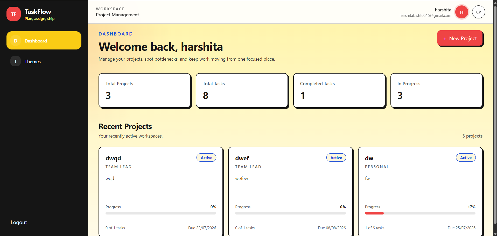

# TaskFlow

TaskFlow is a lightweight Kanban project and task management app built with React (Vite) on the frontend and Node/Express + MongoDB on the backend. It offers project boards, task management, role-based collaboration, and a centralized multi-theme system.

## Highlights

- Authentication (register / login)
- Kanban task board with drag-and-drop
- Project and task CRUD operations
- Team collaboration (project members, roles)
- Centralized theme system with 8 themes and decorations

## Repo layout (important files)

- `backend/` — Node/Express API server (controllers, models, routes)
- `src/` — React frontend source
  - `src/config/themes.js` — theme definitions and storage keys
  - `src/context/ThemeProvider.jsx` — theme provider and persistence
  - `src/pages/ThemeSettings.jsx` — theme settings UI (new)
  - `src/styles/` — theme tokens and CSS variables

> Note: The frontend lives at the repository root `src/` (not a separate `frontend/` folder).

## Quick start (frontend)

1. Install dependencies:

```bash
npm install
```

2. Start the frontend dev server (Vite):

```bash
npm run dev
```

3. Lint the frontend:

```bash
npm run lint
```

## Quick start (backend)

1. Change to the backend folder and install:

```bash
cd backend
npm install
```

2. Create `.env` in `backend/` with these values (example):

```env
PORT=5000
MONGO_URI=your_mongo_connection_string
JWT_SECRET=your_jwt_secret
```

3. Start the backend server:

```bash
npm run dev
```

## Theme system

- Theme settings are available on the dedicated Theme Settings page at `/themes` (sidebar link: "Themes").
- The header shows a compact theme indicator; full controls live only on the `/themes` page.
- Persistence keys (localStorage):
  - Theme: `taskflow-theme`
  - Decorations: `taskflow-decorations`
- To add or change themes edit `src/config/themes.js` and `src/styles/themes.css`.

## Scripts (common)

- `npm run dev` — Run dev server (frontend) from repository root
- `cd backend && npm run dev` — Run backend dev server
- `npm run build` — Build frontend for production
- `npm run lint` — Run ESLint for the frontend

Check `package.json` files for exact script names.

## Contributing

1. Fork and create a feature branch.
2. Run the app locally and ensure linting passes.
3. Open a PR with a clear description and screenshots if applicable.

Please keep theme-related changes centralized in `src/config/` and `src/styles/`.

## Troubleshooting

- If ESLint shows backend/CommonJS errors, run lint only for the frontend or ensure `eslint.config.js` ignores the `backend/` folder (this repo already excludes `backend` by default).
- If themes do not apply, verify `document.documentElement.dataset.theme` and that the theme id exists in `src/config/themes.js`.

## Screenshots



## License

This project is provided under the MIT License.